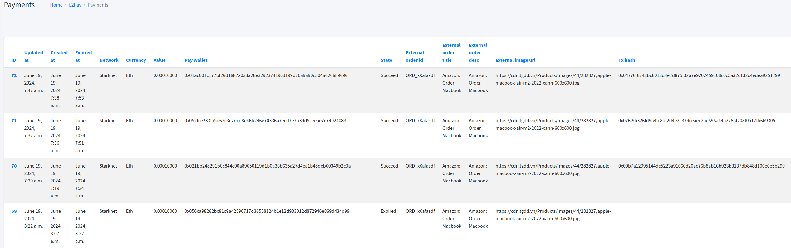

# L2PAY
The FIRST Payment Gateway on Starknet and upcoming all L2 networks

Testnet Dashboard deployment at https://testnet.l2pay.ing/dashboard/

## Experimental

1. Request - Creating a payment
```
curl --location 'https://testnet.l2pay.ing/api/payments/' \
--header 'Content-Type: application/json' \
--header 'Authorization: Api-Key f9zmTDO8.0GhQBVXq78yrKNqqumlIt5jEfF3evsQd' \
--data '{
  "network": "Starknet",
  "currency": "ETH",
  "value": "0.0001",
  "external_order_id": "ORD_xXafasdf",
  "external_order_title": "Amazon: Order Macbook",
  "external_order_desc": "Amazon: Order Macbook",
  "external_image_url": "https://cdn.tgdd.vn/Products/Images/44/282827/apple-macbook-air-m2-2022-xanh-600x600.jpg"
}'
```

Response
```
{
    "id": 74,
    "updated_at": "2024-06-19T13:29:17.610497Z",
    "created_at": "2024-06-19T13:29:17.610505Z",
    "expired_at": "2024-06-19T13:44:17.605386Z",
    "network": "Starknet",
    "currency": "ETH",
    "value": "0.00010000",
    "pay_wallet": "0x00de72960d714c211c4491874a78617582de074569cabecab945a56079f69476",
    "state": "OPEN",
    "external_order_id": "ORD_xXafasdf",
    "external_order_title": "Amazon: Order Macbook",
    "external_order_desc": "Amazon: Order Macbook",
    "external_image_url": "https://cdn.tgdd.vn/Products/Images/44/282827/apple-macbook-air-m2-2022-xanh-600x600.jpg",
    "tx_hash": "",
    "paid_at": null,
    "paid_asset": "ETH",
    "paid_amount": null,
    "paid_usd_rate": null,
    "fee_asset": "ETH",
    "fee_amount": null,
    "net_asset": "ETH",
    "net_amount": null,
    "metadata": null,
    "pay_url": "https://testnet.l2pay.ing/payments/74"
}
```
2. Go to the payment detail page returned on `pay_url` field.
3. Connect Starknet wallet to PAY.

## Screenshot

### Merchant API Key


### List payments


### Payment detail
